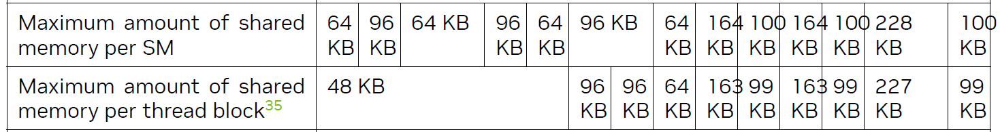
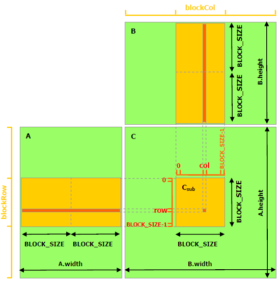

## 原理分析
### 最简单的模型
假设计算N*N的矩阵A X B = C
```C++
∕∕ Matrix multiplication kernel called by MatMul()
__global__ void MatMulKernel(Matrix A, Matrix B, Matrix C)
{
    ∕∕ Each thread computes one element of C
    ∕∕ by accumulating results into Cvalue
    const int MatrixSize = 3;
    float Cvalue = 0;
    int row = threadIdx.y;
    int col = threadIdx.x;
    for (int e = 0; e < MatrixSize; ++e)
        Cvalue += A.elements[row * MatrixSize; + e] * B.elements[e * MatrixSize + col];
    C.elements[row * MatrixSize + col] = Cvalue;
}
```
不用共享内存，先站在线程角度思考一下问题，总共有N*N个线程，每个线程负责计算C的一个值，会读取A的一行和B的一列，总共会分别读取AB矩阵各N次。<br>
当一个线程读取一行一列进行运算的时候，隔壁的线程在干什么呢？ 读取同一行，隔壁的列算出隔壁的值。<br>
不难发现，这里隔壁的线程如果可以使用已经读取过的这一行数据就好了。<br>
用3x3矩阵举个例子

$$
\begin{bmatrix}
a_{11} & a_{12} & a_{13} \\
a_{21} & a_{22} & a_{23} \\
a_{31} & a_{32} & a_{33}
\end{bmatrix}\quad\times\quad
\begin{bmatrix}
b_{11} & b_{12} & b_{13} \\
b_{21} & b_{22} & b_{23} \\
b_{31} & b_{32} & b_{33}
\end{bmatrix}
$$

假设用一个block，内含3*3个thread来并行计算。

那么

thread(0,0) 会读取 $a_{11} a_{12} a_{13}$ 和 $b_{11} b_{21} b_{31}$

thread(1,0) 会读取 <font color="red">$a_{11} a_{12} a_{13}$</font> 和 $b_{12} b_{22} b_{32}$

thread(2,0) 会读取 <font color="red">$a_{11} a_{12} a_{13}$</font> 和 $b_{13} b_{23} b_{33}$

thread(0,1) 会读取 $a_{21} a_{22} a_{23}$ 和 <font color="red">$b_{11} b_{21} b_{31}$</font>

…

不难看出有些数据其实已经从device mem中读取过了，很自然的会想到如果跟CPU的cache一样有一块可以快速访问的区域把这些读取过得数据存下来，就可以减少访存的次数提高程序效率了。

### 引入共享内存优化
CUDA中的shared memory就是这样的一个cache，与CPU cache不同点在于，shared memory可以自由操作其中的内容而不用像CPU cache一样考虑局部性等问题从而提高命中率。

使用__shared_memory__关键字定义一块由block共享的内存

```
__shared__ float As[3][3];

__shared__ float Bs[3][3];
```

然后让每个线程分别读取原AB矩阵中的一个数据填入共享内存中，当所有线程都读取完成后再使用As和Bs中的值进行运算，就达到了目的！相比原来的写法，每个线程需要读取的数据量显著下降了。
```C++
__global__ void MatMulKernel(Matrix A, Matrix B, Matrix C)
{
  // Each thread computes one element of C
  // by accumulating results into Cvalue
  const int MatrixSize = 3;
  float Cvalue = 0;
  int row = threadIdx.y;
  int col = threadIdx.x;
  __shared__ float As[MatrixSize][MatrixSize];
  __shared__ float Bs[MatrixSize][MatrixSize];
  As[row][col] = A.elements[row * MatrixSize + col];
  Bs[row][col] = B.elements[row * MatrixSize + col];
  __syncthreads();
  for (int e = 0; e < MatrixSize; ++e)
    Cvalue += As[row][e] * Bs[e][col];
  C.elements[row * MatrixSize + col] = Cvalue;
}
```
### 通过线性代数优化
然而NV给出的例子并不是如此的简单，当然我们实际要解决的问题规模远不止一个3*3的矩阵，我们不可能把一个非常大的矩阵塞到共享内存中，就像不能把内存里的数据全写到CPU cache中一样，这些高速的存储都是有限的。
<br>
如上图所示，在不同的compute capability中，每个block的共享内存都是受到一定限制的，那么当矩阵足够大的时候，如何去处理它呢？<br>
假设现在一个block中的共享内存最大只能存储两个3x3的矩阵，需要计算3x9的矩阵A和9x3的矩阵B相乘，也就是
$$
\begin{bmatrix} 
a_{11} & a_{12} & \cdots & a_{19} \\
a_{21} & a_{22} & \cdots & a_{29} \\
a_{31} & a_{32} & \cdots & a_{39} 
\end{bmatrix}\quad\times\quad
\begin{bmatrix} 
b_{11} & b_{12} & b_{13} \\
b_{21} & b_{22} & b_{23} \\
& \vdots \\
b_{91} & b_{92} & b_{93} 
\end{bmatrix}\quad=\quad
\begin{bmatrix} 
c_{11} & c_{12} & c_{13} \\
c_{21} & c_{22} & c_{23} \\
c_{31} & c_{32} & c_{33}
\end{bmatrix}
$$
其中
$$
\begin{cases}
c_{11} = a_{11}b_{11} + a_{12}b_{21} + \cdots + a_{19}b_{91} \\
c_{12} = a_{11}b_{12} + a_{12}b_{22} + \cdots + a_{19}b_{92} \\
\vdots\quad\quad\quad\quad\quad\quad\quad\quad\quad\quad\quad\quad\quad\quad\quad\quad\quad\quad\quad\quad\quad① \\
c_{32} = a_{31}b_{12} + a_{32}b_{22} + \cdots + a_{39}b_{92} \\
c_{33} = a_{31}b_{13} + a_{32}b_{23} + \cdots + a_{39}b_{93}
\end{cases}
$$
将矩阵A分解为三个块
$$
\begin{bmatrix}
A_1 & A_2 & A_3
\end{bmatrix}
$$
其中
$$
A_1 =
\begin{bmatrix}
a_{11} & a_{12} & a_{13} \\
a_{21} & a_{22} & a_{23} \\
a_{31} & a_{32} & a_{33}
\end{bmatrix}\quad
A_2 =
\begin{bmatrix}
a_{14} & a_{15} & a_{16} \\
a_{24} & a_{25} & a_{26} \\
a_{34} & a_{35} & a_{36}
\end{bmatrix}\quad
A_3 =
\begin{bmatrix}
a_{17} & a_{18} & a_{19} \\
a_{27} & a_{28} & a_{29} \\
a_{37} & a_{38} & a_{39}
\end{bmatrix}\quad
$$
类似地将B分解成三个块
$$
\begin{bmatrix}
B_1 \\
B_2 \\
B_3
\end{bmatrix}
$$
其中
$$
B_1 =
\begin{bmatrix}
b_{11} & b_{12} & b_{13} \\
b_{21} & b_{22} & b_{23} \\
b_{31} & b_{32} & b_{33}
\end{bmatrix}\quad
B_2 =
\begin{bmatrix}
b_{41} & b_{52} & b_{63} \\
b_{51} & b_{52} & b_{53} \\
b_{61} & b_{62} & b_{63}
\end{bmatrix}\quad
B_3 =
\begin{bmatrix}
b_{71} & b_{72} & b_{73} \\
b_{81} & b_{82} & b_{83} \\
b_{91} & b_{92} & b_{93}
\end{bmatrix}\quad
$$
记
$C_1 = A_1 \times B_1$
则
$$
C_1 =
\begin{bmatrix}
a_{11}b_{11} + a_{12}b_{21} + a_{13}b_{31} & a_{11}b_{12} + a_{12}b_{22} + a_{13}b_{32} & a_{11}b_{13} + a_{12}b_{23} + a_{13}b_{33} \\
a_{21}b_{11} + a_{22}b_{21} + a_{23}b_{31} & a_{21}b_{12} + a_{22}b_{22} + a_{23}b_{32} & a_{21}b_{13} + a_{22}b_{23} + a_{23}b_{33} \\
a_{31}b_{11} + a_{32}b_{21} + a_{33}b_{31} & a_{31}b_{12} + a_{32}b_{22} + a_{33}b_{32} & a_{31}b_{13} + a_{32}b_{23} + a_{33}b_{33}
\end{bmatrix}\quad
$$
类似地，有
$$
C_2 =
\begin{bmatrix}
a_{14}b_{41} + a_{15}b_{51} + a_{16}b_{61} & a_{14}b_{42} + a_{15}b_{52} + a_{16}b_{62} & a_{14}b_{43} + a_{15}b_{53} + a_{16}b_{63} \\
a_{24}b_{41} + a_{25}b_{51} + a_{26}b_{61} & a_{24}b_{42} + a_{25}b_{52} + a_{26}b_{62} & a_{24}b_{43} + a_{25}b_{53} + a_{26}b_{63} \\
a_{34}b_{41} + a_{35}b_{51} + a_{36}b_{61} & a_{34}b_{42} + a_{35}b_{52} + a_{36}b_{62} & a_{34}b_{43} + a_{35}b_{53} + a_{36}b_{63} \\
\end{bmatrix}
$$
以及
$$
C_3 =
\begin{bmatrix}
a_{17}b_{71} + a_{18}b_{81} + a_{19}b_{91} & a_{17}b_{72} + a_{18}b_{82} + a_{19}b_{92} & a_{17}b_{73} + a_{18}b_{83} + a_{19}b_{93} \\
a_{27}b_{71} + a_{28}b_{81} + a_{29}b_{91} & a_{27}b_{72} + a_{28}b_{82} + a_{29}b_{92} & a_{27}b_{73} + a_{28}b_{83} + a_{29}b_{93} \\
a_{37}b_{71} + a_{38}b_{81} + a_{39}b_{91} & a_{37}b_{72} + a_{38}b_{82} + a_{39}b_{92} & a_{37}b_{73} + a_{38}b_{83} + a_{39}b_{93} \\
\end{bmatrix}\quad
$$

由①，可得$C = C_1 + C_2 + C_3$
那么可以在共享内存中先读取A1,B1计算出$C_1$，再依次算出$C_2$，$C_3$，最后累加得到矩阵$C$。<br>
对于每一个线程，只需要依次读取子矩阵的值，等待其他线程同步完成子矩阵读取，累加，最后将结果写入$C$矩阵
```C++
__global__ void MatMulKernel(Matrix A, Matrix B, Matrix C)
{
  // Each thread computes one element of C
  // by accumulating results into Cvalue
  const int SubMatrixSize = 3;
  float Cvalue = 0;
  int row = threadIdx.y;
  int col = threadIdx.x;
  __shared__ float As[SubMatrixSize][SubMatrixSize];
  __shared__ float Bs[SubMatrixSize][SubMatrixSize];
  for(int i = 0; i < A.width / SubMatrixSize ++i){
    //read sub matrix
    As[row][col] = A.elements[row * A.width + i * SubMatrixSize + col];
    Bs[row][col] = B.elements[i * B.width * B.width + row * B.width + col];
    __syncthreads();
    for (int e = 0; e < MatrixSize; ++e)
        Cvalue += As[row][e] * Bs[e][col];
  }
  C.elements[row * MatrixSize + col] = Cvalue;
}
```
### 讨论更多BLOCK的情况
以上的讨论仍然局限于单个block的情况，接下来看一下更大规模的并行计算。<br>
<br>
结合之前的讨论，不难得出一个结论，当block中有BLOCK_SIZE * BLOCK_SIZE个线程时，每次可以从A,B矩阵中分别读取BLOCK_SIZE * BLOCK_SIZE大小的子矩阵最后累加得到矩阵C中BLOCK_SIZE * BLOCK_SIZE大小的子矩阵<br>
从图中不难得出 总共需要(A.height/BLOCK_SIZE) * (B.width/BLOCK_SIZE)个block协作就可以完成矩阵C的计算。<br>
而对于BLOCK中的线程，需要完成的工作则与之前没有区别，读取数据到共享内存，等待同步，完成计算。<br>

## 代码分析
### 数据结构
```C++
typedef struct {
int width;
int height;
int stride;
float* elements;
} Matrix;
```
Matrix用一维数组存储数据所以需要访问row行col列的元素，只需要访问elements[row * width + col]就行，看起来stride似乎是冗余了。<br>
但是实际上不可能矩阵规模刚好就是BLOCK_SIZE的整数倍，此时可能会对矩阵进行填充，所以stride记录的是填充后的矩阵宽度，访问rol行col列就变成了elements[row * stride + col]<br>
### 获取子矩阵
```C++
∕∕ Get the BLOCK_SIZExBLOCK_SIZE sub-matrix Asub of A that is
∕∕ located col sub-matrices to the right and row sub-matrices down
∕∕ from the upper-left corner of A
__device__ Matrix GetSubMatrix(Matrix A, int row, int col)
{
  Matrix Asub;
  Asub.width = BLOCK_SIZE;
  Asub.height = BLOCK_SIZE;
  Asub.stride = A.stride;
  Asub.elements = &A.elements[A.stride * BLOCK_SIZE * row + BLOCK_SIZE * col];
  return Asub;
}
```
此处需要认识到elements是一个指针，访问矩阵元素永远是通过矩阵指针偏移来实现的。<br>
函数的三个参数，Matrix A是原矩阵，row是BLOCK所在的行，col是BLOCK所在的列，调用时会用对应Block Index作为参数而非Thread Index<br>
返回的子矩阵，elements指针放在子矩阵的左上角。<br>
先计算行偏移量，因为子矩阵处于row行的BLOCK中，那么前边应该有row * BLOCK_SIZE行，所以行偏移量为row * BLOCK_SIZE * A.stride<br>
前边有col * BLOCK_SIZE列，所以列偏移量为 col * BLOCK_SIZE，于是elements指针的值就应该是对A.elements[A.stride * BLOCK_SIZE * row + BLOCK_SIZE * col]取地址<br>
### 获取和填入矩阵元素
```C++
∕∕ Get a matrix element
__device__ float GetElement(const Matrix A, int row, int col)
{
  return A.elements[row * A.stride + col];
}

∕∕ Set a matrix element
__device__ void SetElement(Matrix A, int row, int col,
float value)
{
  A.elements[row * A.stride + col] = value;
}
```
结合数据结构，非常容易理解的set和get函数。实际上这两个函数只在操作子矩阵的时候调用到

### 矩阵相乘Kernel
```C++
∕∕ Matrix multiplication kernel called by MatMul()
__global__ void MatMulKernel(Matrix A, Matrix B, Matrix C)
{
    ∕∕ Block row and column
    int blockRow = blockIdx.y;
    int blockCol = blockIdx.x;
    ∕∕ Each thread block computes one sub-matrix Csub of C
    Matrix Csub = GetSubMatrix(C, blockRow, blockCol);
    ∕∕ Each thread computes one element of Csub
    ∕∕ by accumulating results into Cvalue
    float Cvalue = 0;
    ∕∕ Thread row and column within Csub
    int row = threadIdx.y;
    int col = threadIdx.x;
    ∕∕ Loop over all the sub-matrices of A and B that are
    ∕∕ required to compute Csub
    ∕∕ Multiply each pair of sub-matrices together
    ∕∕ and accumulate the results
    for (int m = 0; m < (A.width ∕ BLOCK_SIZE); ++m) {
        ∕∕ Get sub-matrix Asub of A
        Matrix Asub = GetSubMatrix(A, blockRow, m);
        ∕∕ Get sub-matrix Bsub of B
        Matrix Bsub = GetSubMatrix(B, m, blockCol);
        ∕∕ Shared memory used to store Asub and Bsub respectively
        __shared__ float As[BLOCK_SIZE][BLOCK_SIZE];
        __shared__ float Bs[BLOCK_SIZE][BLOCK_SIZE];
        ∕∕ Load Asub and Bsub from device memory to shared memory
        ∕∕ Each thread loads one element of each sub-matrix
        As[row][col] = GetElement(Asub, row, col);
        Bs[row][col] = GetElement(Bsub, row, col);
        ∕∕ Synchronize to make sure the sub-matrices are loaded
        ∕∕ before starting the computation
        __syncthreads();
        ∕∕ Multiply Asub and Bsub together
        for (int e = 0; e < BLOCK_SIZE; ++e)
            Cvalue += As[row][e] * Bs[e][col];
        ∕∕ Synchronize to make sure that the preceding
        ∕∕ computation is done before loading two new
        ∕∕ sub-matrices of A and B in the next iteration
        __syncthreads();
    }
    ∕∕ Write Csub to device memory
    ∕∕ Each thread writes one element
    SetElement(Csub, row, col, Cvalue);
}
```
其实到这里已经没什么好讲的了，外层的循环通过循环变量m，依次调用GetSubMatrix从A B中获取子矩阵的左上角元素指针，再让BLOCK内每个thread填充共享内存，同步后通过内存循环计算累加值。
外层循环结束（也就是遍历完了A，B矩阵对应行列后）将累加的值写入到矩阵C中。
## 性能分析
结合图片，<br>
<br>
可以看出，A中的每个元素，会被读取B.width/BLOCK_SIZE次，才能算完所有影响到的C中的值。对比不使用共享内存的B.width次是一个显著的提升。然而BLOCK中线程数量上限，共享内存的大小都会限制BLOCK_SIZE。另一方面过大的BLOCK_SIZE也会增大每个thread的计算量。在具体的实践中应该结合性能分析工具来选择合适的BLOCK_SIZE。